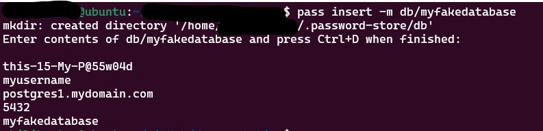

# Connecting to Databases

Some simple use cases

## Postgres SQL

[Official documentation about this image](https://hub.docker.com/_/postgres)

It will ask for password

```bash
export POSTGRES_HOST='<plsql hostname or ip to connect>'
export POSTGRES_PORT='<port to connect>' # usually 5432
export POSTGRES_DB='<database name to connect>'
export POSTGRES_PASSWORD='<Database password>'
export POSTGRES_USER='<Database user name>'
docker run --name plsqlclient -it --rm postgres plsql -h $POSTGRES_HOST -p $POSTGRES_PORT -d $POSTGRES_DB -u $POSTGRES_USER -W
```

or

```bash
export POSTGRES_HOST='<plsql hostname or ip to connect>'
export POSTGRES_PORT='<port to connect>' # usually 5432
export POSTGRES_DB='<database name to connect>'
export POSTGRES_PASSWORD='<Database password>'
export POSTGRES_USER='<Database user name>'
docker run --name plsqlclient -it --rm postgres plsql postgresql://$POSTGRES_USER':'$POSTGRES_PASSWORD'@'$POSTGRES_HOST':'$POSTGRES_PORT'/'$POSTGRES_DB
```

## Oracle Instant Client

[Official documentation about this image](https://github.com/oracle/docker-images/blob/main/OracleInstantClient/README.md)

```bash
export DB_HOST='<database hostname or ip to connect>'
export DB_PORT='<port to connect>' # usually 1521
export DB_SERVICE='<Service name to connect>'
export DB_PASSWORD='<Database password>'
export DB_USER='<Database user name>'
docker run --name orainstcli -it --rm ghcr.io/oracle/oraclelinux8-instantclient:21 sqlplus $DB_USER'/'$DB_PASSWORD'@'$DB_HOST':'$DB_PORT'/'$DB_SERVICE
```

### Using aliases

You can use aliases with [password store](../../GCM/README.md)

Add to your '~/.bash_aliases'

```
alias plsql='f(){ CREDS=$(pass "$1"); IFS=$'\''\n'\'' read -r -d '\'''\'' -a array <<< "$CREDS"; docker run --name plsql -e PGPASSWORD="${array[0]}" -it --rm postgres psql -h "${array[2]}" -p "${array[3]}" -d "${array[4]}" -U "${array[1]}"; unset -f f; }; f'
```

After change this file you need to reload your environment

```bash
source ~/.bashrc
```

Create your credentials using password store


the script will get the information in this order:
```
<password>
<username>
<endpoint>
<port>
<database name>
```

Then you can use this alias to connect to your database

```bash
plsql db/myfakedatabase
```

## MYSQL Client

[Official documentation about this image](https://hub.docker.com/_/mysql)

If password is not provided it will be asked.

```bash
export DB_HOST='<database hostname or ip to connect>'
export DB_PORT='<port to connect>' # usually 1521
export DB_NAME='<Database name to connect>'
export DB_PASSWORD='<Database password>'
export DB_USER='<Database user name>'
docker run --name mysqlcli -it --rm mysql mysql --host=$DB_HOST --port=$DB_PORT --database=$DB_NAME --user=$DB_PASSWORD --password=$DB_PASSWORD
```

### Using aliases

You can use aliases with [password store](../../GCM/README.md)

Add to your '~/.bash_aliases'

```
alias sqlplus='f(){ CREDS=$(pass "$1"); IFS=$'\''\n'\'' read -r -d '\'''\'' -a array <<< "$CREDS"; docker run --name oracli -it --rm ghcr.io/oracle/oraclelinux8-instantclient:21 sqlplus "${array[1]}"/"${array[0]}"@"${array[2]}":"${array[3]}"/"${array[4]}"; unset -f f; }; f'
```

the script will get the information in this order:
```
<password>
<username>
<endpoint>
<port>
<service name>
```

Then you can use this alias to connect to your database

```bash
sqlplus db/myfakedatabase
```
