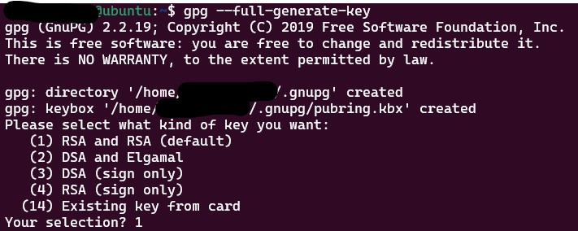
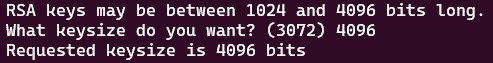
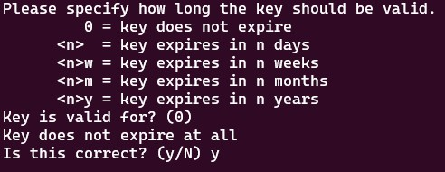
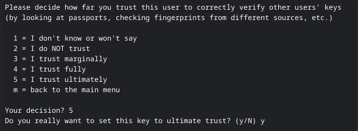
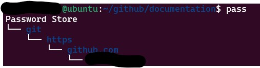
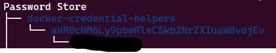

# Using Git Credential Manager

It will create a local vault using pgp and pass to keep your credentials and avoid ask password every time.

## Table of Contents

- [Download GCM](#download-latest-git-credential-manager-gcm)
- [Install GCM](#install-git-credential-manager-gcm)
- [Install gpg](#install-gpg)
- [Install docker-credential-pass](#install-docker-credential-pass)
- [Initialize / generate a key](#initialize--generate-a-key)
- [Install passwordstore](#install-passwordstore)
- [Initiate your passwordstore](#initiate-your-passwordstore)
- [setup your github to use passwordstore](#setup-your-github-to-use-passwordstore)
- [using windows WSL clipboard to avoid show credentials on screen](#using-windows-wsl-clipboard-to-avoid-show-credentials-on-screen)
- [Export / Backup your keys](#export--backup-your-keys)
- [Import / Restore your keys](#import--restore-your-keys)
- [How to use](#how-to-use)
  - [to add credential](#to-add-credential)
  - [to add multiline credential](#to-add-multiline-credential)
  - [to generate credential](#to-generate-credential)
  - [to remove credential](#to-remove-credential)
  - [to see credential](#to-see-credential)
  - [to copy a credential to clipboard](#to-copy-a-credential-to-clipboard)
    - [Using Linux/Mac](#using-linuxmac)
    - [Using windows/wlc](#using-windowswlc)
- [GitHub pass](#github-pass)
- [Docker pass](#docker-pass)
- [Relevant Links](#relevant-links)

## Download latest Git Credential Manager (GCM)

[Check for the latest Release](https://github.com/GitCredentialManager/git-credential-manager/releases)

Run the following command

```bash
export gitcredversion=$(curl -Ls -o /dev/null -w %{url_effective} https://github.com/GitCredentialManager/git-credential-manager/releases/latest | awk -F "/" '{print $NF}' | cut -c2-)
curl -L -o gcm-linux_amd64.deb https://github.com/GitCredentialManager/git-credential-manager/releases/download/v$gitcredversion/gcm-linux_amd64.$gitcredversion.deb
```

## install Git Credential Manager (GCM)

You can run the following command to install the package

```bash
sudo dpkg -i gcm-linux_amd64.deb
rm -rf gcm-linux_amd64.deb
```

## Install gpg

```bash
sudo apt-get install gnupg
```

Add this variable to your environment as default

```bash
echo "export GPG_TTY=\$(tty)" >> ~/.bashrc
```

Reload your environment variables

```bash
source ~/.bashrc
```

## Install docker-credential-pass

```bash
export dockercredversion=$(curl -Ls -o /dev/null -w %{url_effective} https://github.com/docker/docker-credential-helpers/releases/latest | awk -F "/" '{print $NF}')
curl -L -o docker-credential-pass https://github.com/docker/docker-credential-helpers/releases/download/$dockercredversion/docker-credential-pass-$dockercredversion.linux-amd64
chmod +x docker-credential-pass
sudo mv docker-credential-pass /usr/local/bin/
sudo chown root:root /usr/local/bin/docker-credential-pass
sed -i '0,/{/s/{/{\n\t"credsStore": "pass",/' ~/.docker/config.json
```

Adjusting your docker config file (~/.docker/config.json)

```bash
sed -i '0,/{/s/{/{\n\t"credsStore": "pass",/' ~/.docker/config.json
```

## Initialize / generate a key

```bash
gpg --full-generate-key
```



Select '1' => RSA and RSA (default)



Type '4096' as key size



Define the expiration, eg.: 1 year or 0 to never expires

It will ask your Real Name, email and your passphrase (2 times)

Then you can confirm

```bash
gpg --list-secret-keys --keyid-format LONG
```

- `Pay attention to line uid` since you will use that info on your password store settings bellow

If you want to add your [private email address](https://docs.github.com/en/account-and-profile/setting-up-and-managing-your-personal-account-on-github/managing-email-preferences/setting-your-commit-email-address#setting-your-commit-email-address-on-github) from github into your gpg to sign your commits, check on the [documentation](https://docs.github.com/en/authentication/managing-commit-signature-verification/associating-an-email-with-your-gpg-key)

## Install passwordstore

```bash
sudo apt-get install -y pass
```

## Initiate your passwordstore

```bash
pass init "My name <myemail@email.com>" # Info from gpg --list-secret-keys above
```

## setup your github to use passwordstore

```bash
git config --global credential.helper store
git config --global credential.credentialStore gpg
git config --global credential.helper $(whereis git-credential-manager | awk -F\: '{print $2}')
```

## using windows WSL clipboard to avoid show credentials on screen

execute this command to add option to copy password on windows from WSL

```bash
echo "alias cpass='f(){ pass \"\$1\" | clip.exe; unset -f f; }; f'" >>~/.bash_aliases
```

## Export / Backup your keys

```bash
gpg --export-secret-keys $ID > my-private-key.asc
cd ~/
tar -cvzf ps.tgz ~/.password-store/
```

## Import / Restore your keys

```bash
gpg --import $ID < my-private-key.asc
cd ~/
tar -xvzf ps.tgz 
```

After import you must edit your gpg to trust in this key.

**PS**: You will need the uid of your key then 

```bash
gpg --edit-key '<uid>'
gpg> trust
```
It will be presented some options then you can select and confirm number 5 as bellow



Finally just quit

```bash
gpg> quit
```

## How to use

### to add credential

- `it will ask for the credential`

```bash
pass insert <path/credential>
```

### to add multiline credential

- `you can add several lines until press CTRL+D`

```bash
pass insert -m <path/credential>
```

### to generate credential

```bash
pass generate <path/credential>
```

### to remove credential

```bash
pass rm <path/credential>
```

### to see credential

```bash
pass <path/credential>
```

### to copy a credential to clipboard

#### Using Linux/Mac

- `it will keep for 45 seconds`

```bash
pass -c <path/credential>
```

#### Using windows/wlc

- `it will keep for 45 seconds`

```bash
cpass <path/credential>
```

## GitHub pass

Use your git as usual, but the first time it will record your credentials for both proxy and github to avoid asking again

```bash
pass
```



## Docker pass

Use your docker as usual, but the first time it will record your credentials on docker login to avoid asking again

```bash
pass
```



- just for undertanding

your docker credential helper will record your registry as base64 encoded, you can see it using

```bash
echo 'aHR0cHM6Ly9pbmRleC5kb2NrZXIuaW8vdjEv' | base64 -d
https://index.docker.io/v1/
```

## Relevant Links

[GNU Privacy Guard](https://gnupg.org/)

[Password Store](https://www.passwordstore.org/)

[Git Credential Manager (GCM)](https://github.com/GitCredentialManager/git-credential-manager)

[Docker Credential Helper](https://github.com/docker/docker-credential-helpers)
